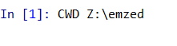
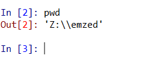

.. _getting_started:

===============
Getting Started
===============

This tutorial is about the first steps to work with *eMZed*, we recommend
to read it before following the tour at :ref:`guided_tour`.

If you start *eMZed* the user interface should look like the following
screen shot.
The window is divided into an editor for *Python* code at the left, and a *variable
explorer* above a *IPython console* with an input prompt at the right. 
You can resize and reorder
them using your mouse. This configuration is stored if you close *eMZed* and if
you start *eMZed* again, it will be restored.

.. figure:: emzed_workbench_overview.png
   :scale: 50 %

How to change the working directory?
------------------------------------

Like a Linux command line *eMZed* has the concept of a *working directory*,
this is where the editor opens new files, and where scripts are
started from if you use the *IPython shell*.

.. figure:: emzed_working_dir.png
   :scale: 65 %

To change the working directory

  1. Press the "choose folder button" of *eMZed* task bar (1.) and choose directory.
  2. Press "set button" (2.) to set the current working directory to the chosen one.

After pressing the "set button" the command to change to the new working
directory is displayed in the IPython console.

You can verify the current working directory by typing ``pwd`` in the IPython
console. Press ``Enter``, type ``pwd`` and press ``Enter`` again.

You can display the content of the current working directory by submitting
the ``ls`` command.

How to to work with the IPython console?
----------------------------------------

You can directly execute *Python*
commands in the provided IPython shell [ipython]_. If you follow the examples
below, this is the place to input and execute the demonstrated commands.

Here is a very simple example how to use the console:

.. figure:: ipython_code.png
   :scale: 75 %

The command creates a string object called ``welcome``. With the print command
the content of ``welcome`` is displayed in the console. The console provides
command completion and automatic dialog boxes showing a list of possible
methods which can be applied to the object ``welcome``. In the same way,
available methods on any type of object are shown automatically. You can
activate command completion after any character by pressing the ``Tab`` button.
All methods which can be applied to the object are displayed in the console by
typing the name of the object followed by ``.``.  For given example:

.. figure:: ipython_object_operations.png
   :scale: 75 %

We will now apply the function ``capitalize`` to the string ``welcome``. You
get the documentation of ``capitalize`` by typing:

.. figure:: ipython_object_function_documentation.png
   :scale: 75 %

We can now to apply the function ``capitalize`` to the object ``welcome``:

.. figure:: ipython_apply_function.png
   :scale: 75 %

The result of the last command executed in the IPython console is always
accessible via underscore ``"_"``.  In case you forgot to assign a variable
name to a result you can do that afterwards by using the underscore ``"_"``.

.. figure:: ipython_working_with__.png
   :scale: 75 %

Further you can  navigate through commands you entered before using
the ``Cursor-Up`` and ``Cursor-Down`` keys. For more information about
using *IPython* [ipython]_ see the Introduction at [ipython_introduction]_ .

To get online help on IPython console type ``help()``.

You can find a more detailed IPython tutorial here_.

.. _here: http://ipython.org/ipython-doc/stable/interactive/tutorial.html

How to run scripts ?
--------------------

If you later program workflows these are Python scripts using functionalities
from the *eMZed* framework.

You can use the *Editor* to write scripts and functions which can be executed
in the IPython console. Here is a very simple example which
implements a function that calculates the mass of water:

.. figure:: using_editor_code.png
   :scale: 75 %

Type the code into the editor and save it as ``using_editor_code.png``
into your working directory.

There are two possibilities to run scripts in *eMZed*.

 1. You can execute the script currently displayed in the Editor  by simply
    pressing the ``F5`` button. When the script is executed the first
    time a dialog box will open. Choose the first option "Execute in current
    IPython or Python interpreter".

     .. figure:: run_script.png
        :scale: 75 %

    When running the script you see that the ``print`` statement in the
    last line of the example code is executed. Further the function
    ``mass_of_water`` is now available in the
    IPython console. Type the name of the function followed by ``()``
    and press ``Enter`` to execute it.

     .. figure:: run_script_executing.png
        :scale: 75 %

 2. You can also use the command ``runfile``. If the file is saved in the
    working directory you simply type ``runfile("filename.py")`` in the IPython
    console. For given example:

    .. figure:: run_script_alternative.png
        :scale: 75 %

If the script is not located in the working directory you have to add the path
of the script to its name like  ``runfile(".../folder/filename.py")``.

How to use eMZed modules?
-------------------------

As an *example* we determine the isotope distribution of molecular formula
*C6H13O9P*. It can be calculated using the method *isotopeDistributionTable* of
the main *eMZed* module ``ms``. After typing ``ms.`` the auto completion shows
all methods of the module ms.

.. figure:: ipython_autocompletion.png
   :scale: 75 %

You can reduce the number of methods by typing ``ms.i`` and pressing the ``Tab``
button.

.. figure:: ipython_tab_button.png
   :scale: 75 %

To get help on the function type ``ms.isotopeDistributionTable?`` or
``help(ms.isotopeDistributionTable)`` and press ``Enter``.

.. figure:: emzed_modules_help.png
   :scale: 75 %

To execute the function type with default parameter settings type
``isotopes = ms.isotopeDistributionTable("C6H13O9P")`` and press ``Enter``.

.. figure:: ipython_execute_function.png
   :scale: 75 %

How to inspect objects?
-----------------------

.. _below:

The variable explorer provides an easy way to inspect all kinds of Python
objects. All object names and their properties are listed in the variable
explorer.  Here an example:

.. figure:: variable_explorer.png
   :scale: 75 %

To visualize the content of the variable ``isotopes`` double click the row and
a new window with the table explorer opens:

.. figure:: table_explorer.png
   :scale: 75 %

Some objects like e.g. tables have a print method. Type ``.print_()`` after
a table object and you can directly print the result in the console.

.. figure:: table_print().png
   :scale: 75 %

More about Python
-----------------

To write your own scripts basic knowledge in Python is mandatory. However,
Python is very easy to learn.

You find a comprehensive list of Python tutorials at
http://wiki.python.org/moin/BeginnersGuide

