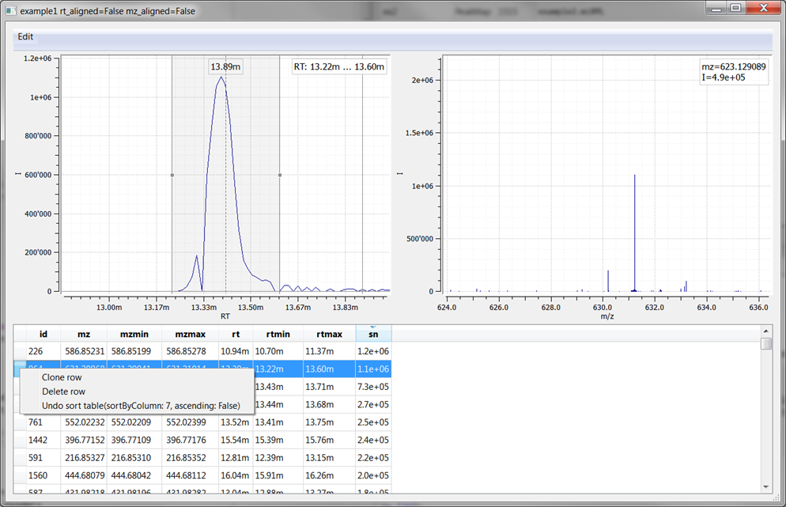
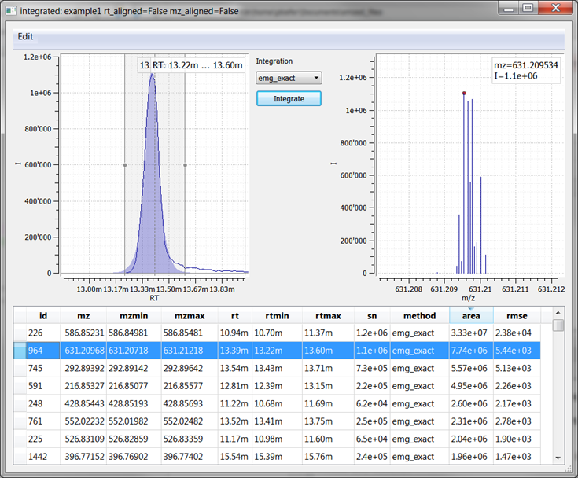
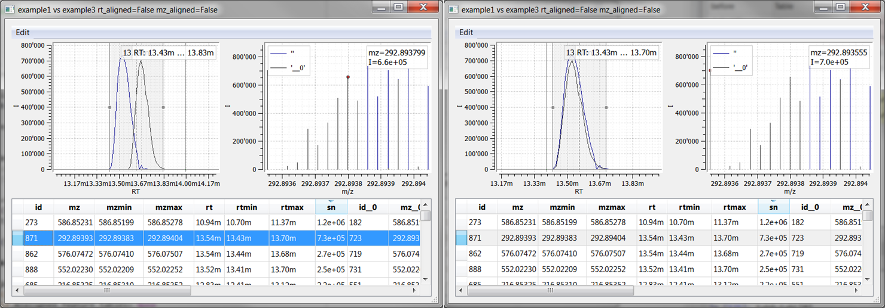

=============
A Guided Tour
=============

This is a short tour for getting a first impression about working with *eMZed*.
Please follow the instructions at :ref:`installation` before you 
continue.

When you start *eMZed* the first time, after some setup as described in
:ref:`installation`, the application window will look similar to the following
screenshot:

.. figure:: eMZed.png
   :scale: 50 %

   (Click on the image to enlarge)

The window is divided into an editor for *Python* code at the left, and a *variable
explorer* above a *Python console* with an input prompt at the right. 
You can resize and reorder
them using your mouse. This configuration is stored if you close *eMZed* and if
you start *eMZed* again, it will be restored.

.. _ipython_example:

Working with IPython command line
---------------------------------

You can directly execute *Python*
commands in the provided IPython shell [ipython]_. If you follow the examples below, this is the place
to input and execute the demonstrated commands.

.. pycon::
   :invisible:

   import ms
   import tab
   import db
   import batches
   import mass
   import abundance
   import elements

To check if everything works fine you can try:

.. pycon::
    print mass.C13
    

The console provides command completion and automatic dialog boxes showing a list
of possible commands.  In the same way, available operations on any type of
object are shown automatically.

Most functions and operation are found in the ``ms`` module, which has numerous
functions. *eMZed* imports ``ms`` and other important modules automatically at
startup.  If you enter ``ms.`` (including the final dot !) at the command line
you get suggestions as shown in the following screenshot:

.. image:: console_code_completion.png
   :scale: 60 %  

You can select an entry with the cursor keys and accept the selection
by pressing the ``Enter`` key.
   
Further you can  navigate through commands you entered before using
the ``Cursor-Up`` and ``Cursor-Down`` keys. For more information about
using *IPython* [ipython]_ see the Introduction at [ipython_introduction]_ .

.. _peakmaps_example:

Working with Peak Maps
---------------------- 

*eMZed* allows loading, inspecting and basic filtering of
LC-MS(/MS) data files in different formats. To load your single data files to
the workspace use the command ``loadPeakMap``. If you are unsure how to use a
command, you can get some help as follows: 

.. pycon::
   :invisible:
 
   ds = ms.loadPeakMap("../emzed_files/example1.mzXML") 

.. pycon::
    help(ms.loadPeakMap) 

So if we call the function without giving a specific path, you will be asked to
choose a file. Please choose the file ``example1.mzXML`` from your current
folder:

.. pycon::
   ds = ms.loadPeakMap() !noexec

You can access the spectra in this peak map using Python:

.. pycon::
   firstSpec = ds.spectra[0]
   print firstSpec.rt, firstSpec.msLevel, firstSpec.polarity
   lastSpec = ds.spectra[-1]
   print lastSpec.rt

Internally retention times are always stored as seconds.

The variable ``ds`` will appear in the *variable explorer*. You see that we
have 464 spectra in this dataset and you can visualize them simply by double
clicking at ``ds``.

.. image:: peakmap_variable_explorer.png
   :scale: 60 %
   
Alternatively use the command

.. pycon::
   ms.inspectPeakMap(pm) !noexec

.. image:: inspect_peakmap1.png
   :scale: 50 %
   

The upper plot shows the TIC and the lower plot the ms spectrum indicated by
the bar with the center dot. 

.. image:: inspect_peakmap2.png
   :scale: 50 %

A. You can move the bar in the upper chromatogram plot with the mouse by clicking
   the bar.
   m/z values and intensities of mass peaks in the chosen
   spectrum are depicted in the lower plot. 
   
B. You can extract an ion chromatogram by entering data
   into the two input fields  for providing a
   central ``m/z`` value and a half window width ``w/2`` and then pressing ``Select``.
   If you 
   press the right button during moving the mouse the plots will zoom in or out.
   Pressing the ``backspace`` key will reset the active plot.
   Further you can measure peak relations by dragging the mouse in the lower
   plot.

.. _centwave_example:

Extracting chromatographic peaks
---------------------------------

Actually, *eMZed* includes two peak detection algorithm of the *XCMS* [xcms]_ package:
*centwave* [centwave]_ and *matched filters*. Accepted input file formats are *mzML*,
*mzxml*, and *mzData*.  The output file format is *eMZed*-specific 
and has the file extension ``.table``. In addition ``.csv`` files are saved.

We continue with an example of Centwave algorithm for high resolution LC-MS data. 
You can start the *Centwave* feature detector by typing

.. pycon::
   tables = batches.runCentwave("*.mzXML", destination=".", configid="tour")!noexec 

.. pycon::
   :invisible:

   tables = batches.runCentwave("../example_scripts/*.mzXML", destination=".", configid="tour") !noexec
   for i, t in enumerate(tables): t.store("feat%d.table" % i) !noexec
   tables = [ ms.loadTable("feat%d.table" % i) for i in range(3) ]
       
The feature detector needs a few minutes depending on the power of your computer, we omitted the
verbose output from *XCMS* [xcms]_ .
We predefined a combination of parameters with the identifier ``tour`` in order
to simplify the tour. In general various parameters can be provided
individually. For getting (a lot of) details use the *Python* help system

.. pycon::
   help(batches.runCentwave) !noexec

The return value ``tables`` is a  list containing three tables, 
you see them in the *variable explorer*.

.. image:: tableListVarBrowser.png
   :scale: 50 %
 
Please open
the table list by double clicking the variable ``tables`` in the *variable
explorer*.  

A. Now you can select a specific table using the ``Choose Table`` menu at the
   top of the window. In each table parameters of detected peaks are depicted
   row wise. You can visualize corresponding *Extracted Ion Chromatograms*
   (*EIC*) and mass spectra by clicking to the left of a row. Table entries
   are editable (just double click to a certain cell) and all modifications are
   stored in place.  Notice that the original peak map is linked to the table
   and the underlying spectral data is accessible. 

B. If you click with the right mouse button to the left of a row
   you see a context menu with commands for manipulating whole rows. 
   All manipulations to the table can be undone using this context menu
   or the commands below the ``Edit`` menu at the top of the window.

.. _integration_example:

Integrating Peaks
-----------------

To reduce the runtime in the
following demonstration we will extract peaks with an signal to
noise ratio above ``5e4``:

.. pycon::
   tab1, tab2, tab3 = tables
   print len(tab1)
   tab1 = tab1.filter(tab1.sn > 5e4) 
   print len(tab1)
   tab2 = tab2.filter(tab2.sn > 5e4) 

Detected Peaks can be integrated. To perform peak integration columns *rtmin*,
*rtmax*, *mzmin*, and *mzmax* are mandatory. We use the *EMG* integrator:

.. pycon::
   tabInt = ms.integrate(tab1, 'emg_exact') 

If you open the dialog for ``tabInt`` you see

A. For all integrated peaks *area* and *rmse* values are added automatically 
   to the table. As *EMG* fits a function to the *EIC*, you see this function
   in the chromatogram plot.

B. You can manually reintegrate individual *EIC* peaks by adapting the *rt* bounds
   in the chromatogram plot, then choosing one of the provided integration
   methods and pressing ``Integrate``.
   The result will be plotted in the chromatogram plot and the corresponding
   row is updated.

.. _rtalign_example:

Aligning Features
-----------------

The retention time alignment is performed by the Pose Clustering 
alignment algorithm [poseclustering]_ implemented in OpenMS [openms]_.

.. pycon::
   tablesAligned = ms.rtAlign(tables, destination=".") !nooutput

In this simple use case all tables are aligned to the table with the most peaks.

To visualize the *rt* shift on tables we will now combine two tables before and
after alignment. 
Users which are familiar to relational databases will recognize the
``JOIN`` statement from the ``SQL`` language. More information about
combining and filtering tables will be given below at :ref:`table_example`.

.. pycon::
   before = tab1.join(tab2, tab1.mz.approxEqual(tab2.mz, 3*MMU) & tab1.rt.approxEqual(tab2.rt, 30*SECONDS))   

Open the window for table ``before`` and sort the table to ascending  ``sn`` values
and click on column with ``id`` 191.  

Now repeat the same procedure for the same tables after retention time
alignment:

.. pycon::
   tabA1, tabA2, tabA3 = tablesAligned
   tabA1 = tabA1.filter(tabA1.sn>5e4) 
   tabA2 = tabA2.filter(tabA2.sn>5e4)
   after = tabA1.join(tabA2, tabA1.mz.approxEqual(tabA2.mz, 3*MMU) & tabA1.rt.approxEqual(tabA2.rt, 30*SECONDS)) 

Open now the table ``after``, sort again and choose the same row as above.

The plot shows the overlay of two *EIC* peaks of the same compound in two different samples before (A) and after (B) retention time alignment.

.. _table_example:

Working with Tables
-------------------

This section demonstrates some operations on tables, which are a central data
structure in *eMZed*, you have already seen them above as peak tables. 

An easy way to create tables is to parse a *csv* file. This is how the
content of ``example.csv`` looks like:

.. pycon::

    print open("example.csv").read()

We load this table and print some information about it:

.. pycon::
    substances = ms.loadCSV("example.csv")
    substances.info()
    substances.print_()
    

That is the table has two columns named ``name`` and ``mf`` and both
contain data of type ``str``.

If the table is to complex or large for printing, you can open a dialog by clicking to the
``substances`` entry in the *variable explorer*  or from the command line:

.. pycon::

    ms.inspect(substances)  !noexec

Adding a new, computed column is easy. Here we want to generate a new column ``m0``
which contains the mono-isotopic masses corresponding to the contents of the
``mf`` column. Converting a molecular formula to the corresponding mono-isotopic
weight can be done by the function ``mass.of``:

.. pycon::

    print mass.of("H2O") 

Generating the new column ``m0`` is done by applying this function to
the column ``substances.mf``:

.. pycon::

    substances.addColumn("m0", substances.mf.apply(mass.of))
    substances.print_()

Now we want to add some extra information to ``substances``, this
information is stored in ``information.csv``:

.. pycon::
    print open("information.csv").read()
    info = ms.loadCSV("information.csv") 
    info.print_()

As you can see ``ms.loadCSV`` recognized that the column ``info.onEarth`` only
contains integers.

To combine both tables we use an SQL-like ``LEFTJOIN`` to match rows with the
same molecular formula:

.. pycon::

    joined = substances.leftJoin(info, substances.mf==info.mf)
    joined.print_()

To restrict to substances which are known to exist on earth we can do:

.. pycon::

    common = joined.filter(joined.onEarth__0==1)
    common.print_()

The ``tab`` module contains some databases, e.g. the substances from PubChem  [pubchem]_
categorized as *metabolomic compounds*. These databases are hold in tables:

.. pycon::

    pc = tab.pc_full 
    pc.filter(pc.cid <= 3).print_()
    ms.inspect(pc)  !noexec

Before matching our data against the large PubChem table, we build an index on
this table in order to speed up the following ``leftJoin`` call.  Building an
index is done by sorting the corresponding column:

.. pycon::

    pc.sortBy("m0")
    matched = joined.leftJoin(pc, (joined.onEarth__0==1) & joined.m0.approxEqual(pc.m0, 15*MMU))
    print matched.numRows()
    matched.print_()
    ms.inspect(matched)  !noexec

Another way to identify compounds is to use the Metlin web page which provides a form for running queries against the database. This access is automated: 

.. pycon::

    common.addColumn("polarity", "-") # metlin need this
    matched2 = ms.matchMetlin(common, "m0", ppm=15)
    matched2.print_()
    ms.inspect(matched2) !noexec

.. _chemistry_example:

Accessing Chemical Data
-----------------------

The ``mass`` module provides the masses of an electron, a
proton or a neutron and all all important elements

.. pycon::

    print mass.e # electron
    print mass.C, mass.C12, mass.C13

Further it helps to calculate masses of molecules from their sum
formula

.. pycon::

    print mass.of("C6H2O6")

One can consider isotopes too:

.. pycon::

    print mass.of("[13]C")
    print mass.of("[13]C6H2O6")
    print mass.of("[13]C3[12]C3H2O6")

The ``elements`` module provides information
of important elements

.. pycon::

    print elements.C
    print elements.C13

``abundance`` is a module which provides the natural abundances of
common elements

.. pycon::

    print abundance.C

.. _isotope_example:

Analyzing isotope patterns
--------------------------

As the ``Table`` objects provide powerful matchings, all we need to
analyze isotope patterns occurring in feature tables is a way to generate
tables containing these data. ``ms.isotopeDistributionTable``
does this 

.. pycon::

    tab = ms.isotopeDistributionTable("C4S4", minp=0.01)
    tab.print_()

Non natural distributions as in marker experiments can be
simulated too

.. pycon::

    iso = ms.isotopeDistributionTable("C4S4", C=dict(C12=0.5, C13=0.5))
    iso.replaceColumn("abundance", iso.abundance / iso.abundance.sum() * 100.0)
    iso.print_()

The method can simulate the resolution of the used mass analyzer

.. pycon::

    tab = ms.isotopeDistributionTable("C4S4", R=10000, minp=0.01)
    tab.print_()

Matching isotope patterns now works like this

.. pycon::

    iso = ms.isotopeDistributionTable("H2O", minp=1e-3)
    iso.addEnumeration()
    iso.print_()

.. pycon::

    common.dropColumns("mf__0", "onEarth__0")
    matched = iso.leftJoin(common, iso.mass.approxEqual(common.m0, 1*MMU))
    matched.print_()

.. _statistics_example:

Statistical Analysis
--------------------

The framework provides two methods for comparing two datasets by analysis of variance: classical *one way ANOVA* and
non parametric *Kruskal Wallis* analysis.
These methods work on tables like
this

.. pycon::

    group1 = [ 1.0, 0.9, 1.2, 1.4, 2.1]
    group2 = [ 1.0, 2.2, 2.3, 1.9, 2.8, 2.3]

    t = ms.toTable("measurement", group1 + group2)

    indices = [1]*len(group1) + [2] * len(group2)
    print indices

    t.addColumn("group", indices)
    t.print_()

``ms.oneWayAnova`` returns the corresponding ``F`` and ``p`` value, ``ms.kruskalWallis`` the ``H`` and ``p`` value

.. pycon::

    F, p = ms.oneWayAnova(t.group, t.measurement)
    print p

.. pycon::

    H, p = ms.kruskalWallis(t.group, t.measurement)
    print p

.. _dialogbuilder_example:

Building graphical interfaces
-----------------------------

Beyond the ``Table``-Explorer ``ms.inspect`` and the ``PeakMap``-Explorer
``ms.inspectPeakMap`` assisted work-flows request certain parameters and
decisions at certain processing steps. To support this mzExplore has an builder
for graphical input forms. 

The following dialogue is created by the simple commands below:

.. image:: dialogbuilder.png

.. pycon::

    b = ms.DialogBuilder(title="Please provide data")
    b.addInstruction("For Algorithm A please provide")
    b.addInt("Level")
    b.addFloat("Threshold")
    b.addFileOpen("Input File")
    print b.show()                            !noexec
    (10, 1.02, 'C:/Dokumente und Einstellungen/e001.mzML') !asoutput
